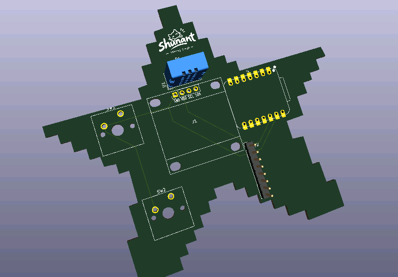
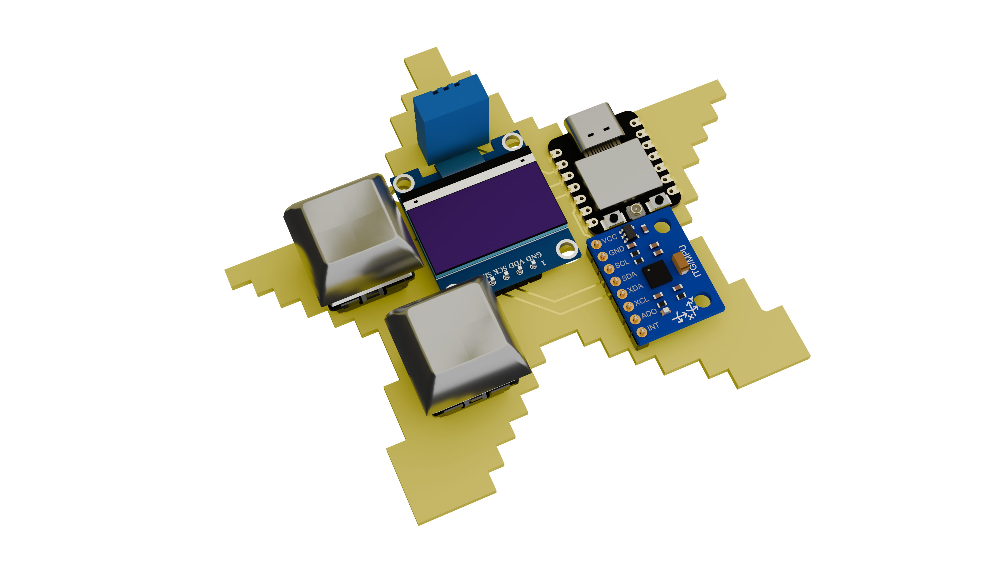
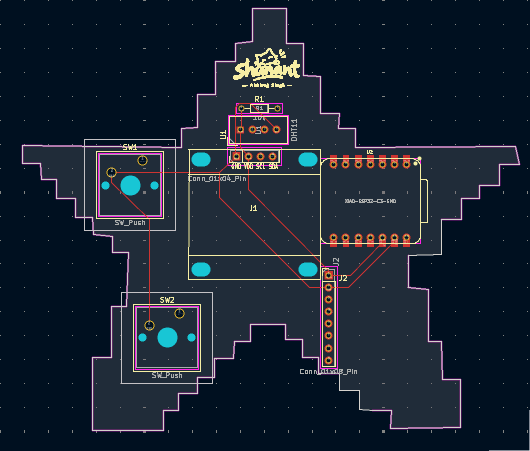
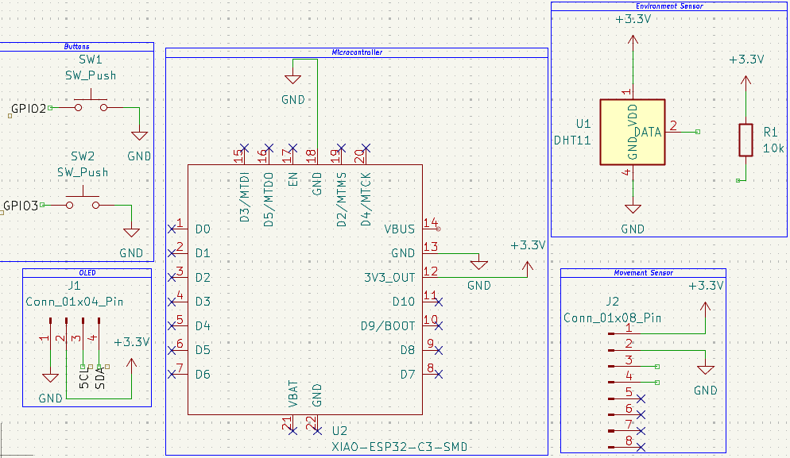

# Starbie

Starbie is a small motion-controlled digital pet built around a Seeed XIAO ESP32-C3. The Arduino firmware animates a pet on a 128x64 I2C OLED and responds to two buttons and movement input. The design also includes a DHT11 temperature/humidity sensor.

## Project images

> The repository's image directory is spelled `assests`; image paths above use that exact spelling.

## Hardware represented by the design

- Seeed XIAO ESP32-C3 development board (U2)
- 0.96-inch, 128x64 I2C OLED interface (J1)
- Two Cherry MX-compatible keyboard switches (SW1 and SW2)
- MPU6050 motion-sensor breakout connection (J2)
- DHT11 temperature/humidity sensor (U1)
- 10 kOhm through-hole resistor (R1)

See [`Bom.csv`](Bom.csv) for the source-derived board parts list. Manufacturer part numbers, tolerances, and ratings are not added when the project files do not specify them.

## Firmware

The Arduino sketch is [`Firmware/Starbie/Starbie.ino`](Firmware/Starbie/Starbie.ino). It provides a four-action menu (NAP, PLAY, FEED, PET), a stats screen, and motion reactions. The sketch's beginner settings are near the top of the file.

### Upload

1. Install Arduino IDE.
2. Add Espressif's ESP32 Boards Manager URL: <https://espressif.github.io/arduino-esp32/package_esp32_index.json>.
3. Install **esp32 by Espressif Systems** in Boards Manager and select **XIAO_ESP32C3**.
4. Install **Adafruit GFX Library**, **Adafruit SSD1306**, **Adafruit MPU6050**, and **DHT sensor library** in Library Manager. Install any dependencies Arduino offers.
5. Open the sketch and upload it to the board.

### Default pin mapping

| Function | XIAO pin | ESP32-C3 GPIO |
| --- | --- | --- |
| OLED and MPU6050 SDA | D4 | GPIO6 |
| OLED and MPU6050 SCL | D5 | GPIO7 |
| DHT11 data | D1 | GPIO3 |
| Button 1 (menu/select) | D2 | GPIO4 |
| Button 2 (stats) | D3 | GPIO5 |

Default I2C addresses in the sketch are 0x3C for the OLED and 0x68 for the MPU6050.

## Controls

- Button 1 opens the radial menu; tilt to move the selector; press Button 1 again to choose an action.
- Button 2 shows or hides the stats screen.
- Shake the device for the pet's movement reaction.

## KiCad design files

Open [`starbie/starbie.kicad_pro`](starbie/starbie.kicad_pro) in KiCad. The schematic and PCB are [`starbie/starbie.kicad_sch`](starbie/starbie.kicad_sch) and [`starbie/starbie.kicad_pcb`](starbie/starbie.kicad_pcb).

The repository also includes the XIAO symbol library (`Seeed_Studio_XIAO_Series.kicad_sym`), custom footprints (`Imported Parts.pretty/` and `starbie/logo.pretty/`), and 3D models in `3D Models/`.

### Footprint naming check

The schematic value and firmware identify U2 as an ESP32-C3, while the selected PCB footprint library ID is named `Imported Parts:XIAO-ESP32-C6-DIP`. Verify the intended physical module/footprint pairing before ordering or assembling boards; this README does not assume that the names are interchangeable.

## Reference

The firmware setup follows the [Starbie Week 1 Guide](https://github.com/SharKingStudios/Starbie/blob/main/Week%201%20Guide.md).
